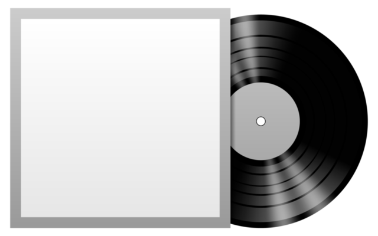

## **Vinyl** --- yet another programming language

## **About**
Vinyl is a pet programming language, aimed to explore several concepts in computer science. It is inspired by Python, Lua, MATLAB.

Current features of Vinyl:
- dynamic typing
- garbage collection
- stack-based virtual machine
